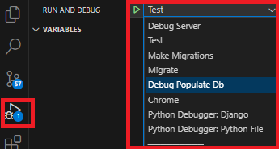
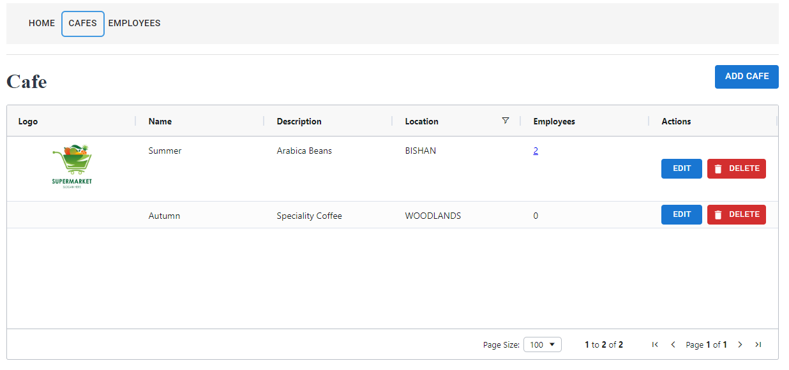
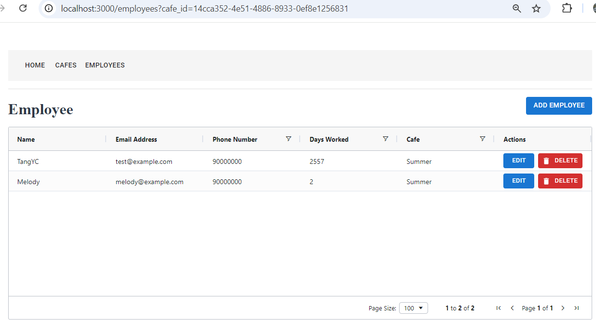
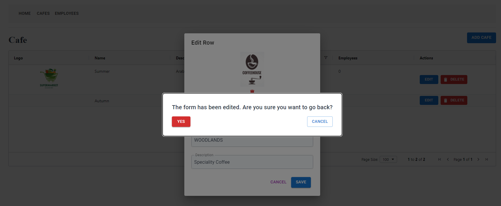
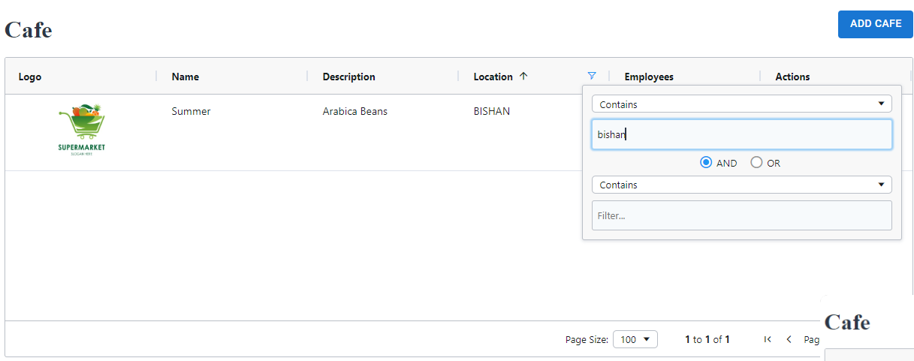
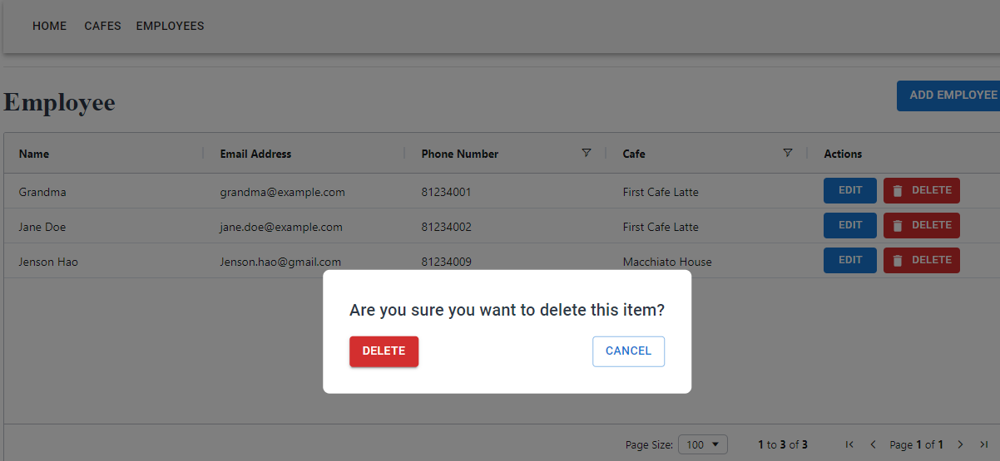
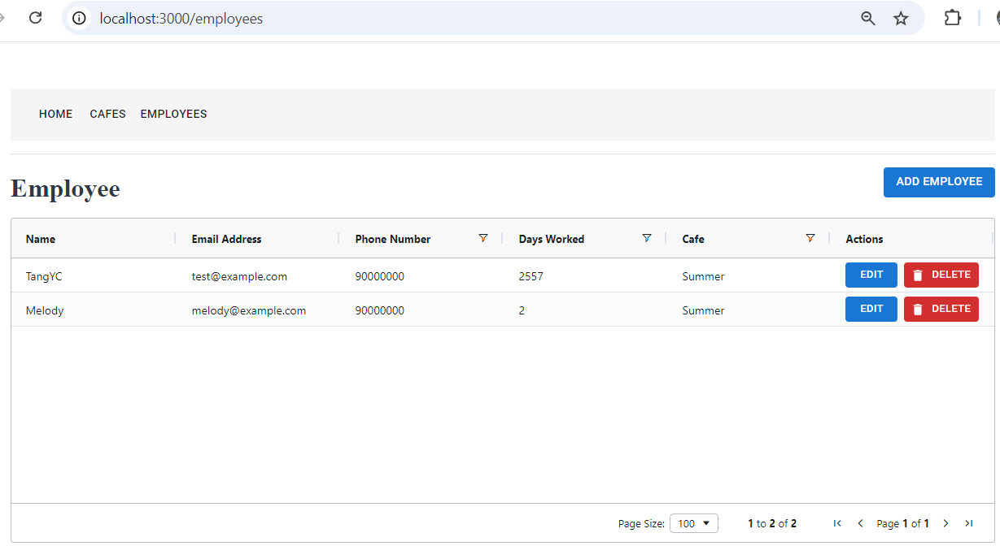
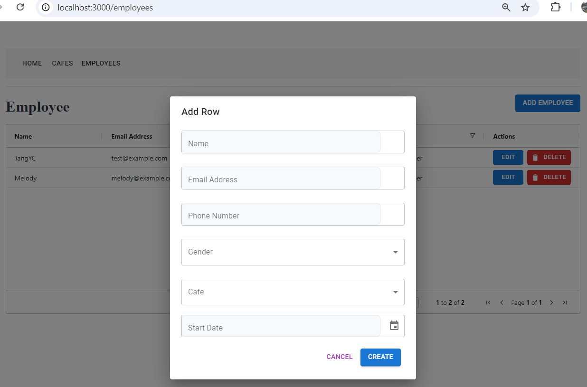

# Developed in Windows
# These are the Requirements:
- Docker desktop
- wsl 2 with linux distribution (Ubuntu)
- git

# Quick Start in *powershell*
`git clone https://github.com/chiathepanda/coding_interview.git`

`cd coding_interview`

Build and then start the containers

`docker-compose build --no-cache`

`docker-compose up`

Frontend is accesible via: http://localhost:3000/ <br/>
Backend is accesible via: http://localhost:8000/

Terminate with:

`docker-compose down`

# Alternative to skip the build step:
`git clone https://github.com/chiathepanda/coding_interview.git`

`cd coding_interview`

Login to docker via this cmd line and follow the instructions:

`docker login`

Pull the pre-built images from Docker Hub:

`docker-compose pull`

Start the containers:

`docker-compose up`

Frontend is accesible via: http://localhost:3000/ <br/>
Backend is accesible via: http://localhost:8000/

Terminate with:

`docker-compose down`

For the requirement of production ready in the instructions I commented out the code where docker secret was used SSL/TLS cert/key was stored with docker secret.
___

# Requirements for development:
- MySQL server (Create a database called `astekproject`)
- python 3.12
- pipenv
- node

# Steps for development:
A requirements.txt was generated through `pipenv requirements > requirements.txt`. </br>
pipenv was activated in the same folder as manage.py `pipenv install` will install and create a virtual enviroment
Run the following : 
> cd myproject

> pipenv install 

# Debug on vs code
Added via ./.vscode/launch.json (press F5 on vs code). Ctrl + Shift + P and select the virtual python interpreter<br/>


Make Migrations > Migrate > Debug Populate Db > Debug Server

coding_interview/client: 
`npm install`

`npm run build`

`npm run dev`

**.env files are in client and current folder**

# Notes
- To enable communication between backend and db, I wasn't aware django didn't accept self-signed certificates, so I commented it out.
- Employee ID are all uppercase
- I added created_at updated_at for the models (but I ignored the timezone warning for this exercise since start_date is date)
- On the last page of the problem statement: Location [Reusable Textbox]
so, I did not use latitude and longitude for location. (could have implemented onto the model with django's django.contrib.gis.db)
- I think the cafe name should be unique but I just followed the instructions.
- I used: npm create vite@latest client --template react
- For GET endpoint /employees?cafe=<café>
    - the email_address in the instruction was duplicated, i only returned 1 email_address
    - gender is returned
    - both cafe's id and name is returned instead of just name, so that I could relate it by id instead of name by cafe
- male/female value is lowercase in the database
This is the key-value for how employee is releated to cafe
"cafe_relation": {
    "cafe_id": "8b285725-aa78-4990-8751-179640bf1945",
    "start_date": "2024-10-10"
}

comment out in coding_interview/backend/docker.sh If you don't want the dummy data
`python manage.py populate_db

# PREVIEW:
Screenshot as Examples. Note: The Add/Edit Forms and some components share the same Base.

Cafe Page:

Employee By Cafe (By Clicking Employees on Cafe Page):

Trigger warning on back (in front of Edit PopUp of Cafe):

Filter Cafe By Location:

Delete warning:

Employee Page:

Create Employee Page:


# Troubleshooting:
1) Check the .env and ./client/.env 
2) Create .wslconfig file in C:\Users\USERNAME and restart docker
Example of .wslconfig
```
[wsl2]
processors=5
memory=8GB    
swap=4GB     
localhostForwarding=true 
```

3) If Docker is stuck or there's an issue with cache:

`docker system prune -a`

`docker volume prune -a`

`docker builder prune -a`

4) If Docker is still stuck, even with restarting:
On windows, use task manager to stop Docker and wsl processes.
reinstall docker (Delete AppData too)

# References:
https://mui.com/material-ui/getting-started/templates/ <br/>
https://ant.design/docs/react/introduce <br/>
https://www.ag-grid.com/react-data-grid/getting-started/ <br/>
https://formik.org/docs/overview <br/>
https://hub.docker.com/_/python/ <br/>
